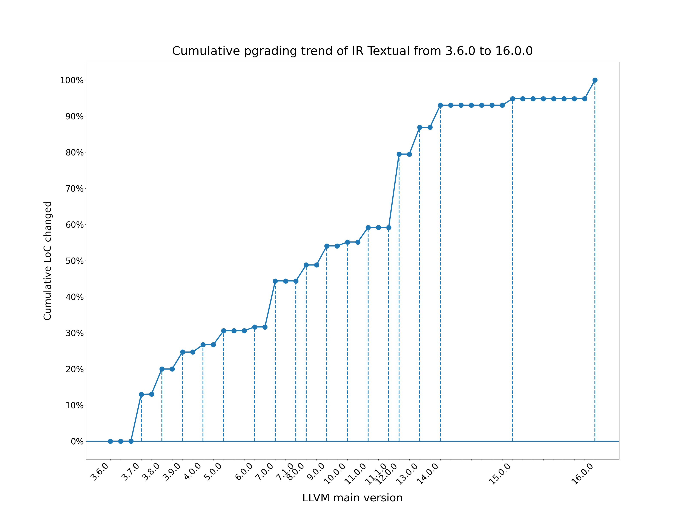
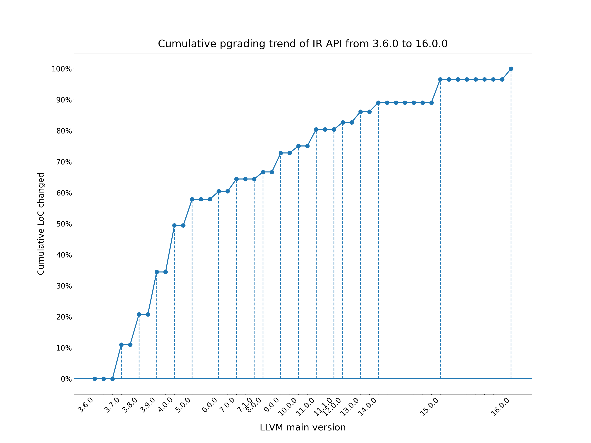
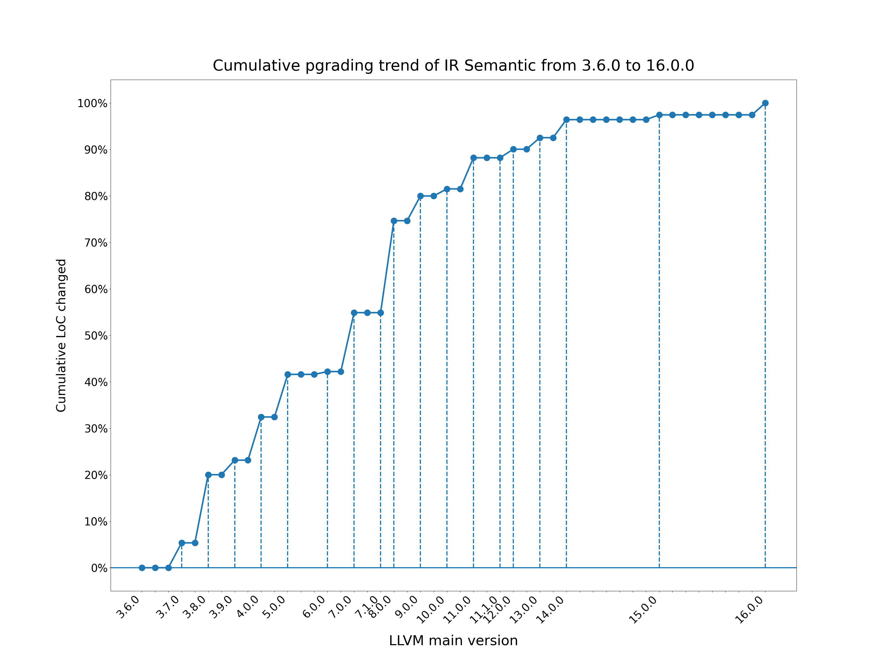

# llvm-upgrading-trend

This repo is used for tracking the LLVM IR-related upgrading trend, which help us choosing the appropriate version of building static analyzer. The idea of buliding this repo comes from Bowen Zhang's [paper](https://dl.acm.org/doi/10.1145/3620666.3651366), where the compability issues between different IR versions[^1] are categorized into three types: Textual, API, and Semantic.

## Overall upgrading trend

First please clone the LLVM repo to a local path[^2]. To get the [overall upgrading trend](./figures), run the [script](./src/overall.py) as follows:

```bash
./scripts/overall.py --repo_path <LLVM_REPO_PATH>
```

The script will generate overall upgrading trend in terms of each compability type, based on changed LoC. The per-file upgrading trend data (for example [Instrutions.h](./data/Instructions.h.csv)) will also be saved.

## Demo

- Text compability



- API compability



- Semantic compability



## TODO

- [ ] : collect more IR files

## Fine-grained comparison between versions

To get the detailed change between versions, using [GitHub's `/compare` view](https://docs.github.com/en/pull-requests/committing-changes-to-your-project/viewing-and-comparing-commits/comparing-commits).

:warning: Better not compare between two commits that have huge gap, the webpage might crash

[^1]: We only focus on forward compability issues here since LLVM has maintained some [backward compability](https://llvm.org/docs/DeveloperPolicy.html#ir-backwards-compatibility)
[^2]: why not use GitHub REST API to compare? Because the LLVM repo is extremly huge and the "compare between two commits" doesn't support file-level argument, we need to manually deal with its pagination scheme and may lost results